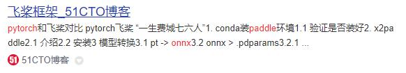
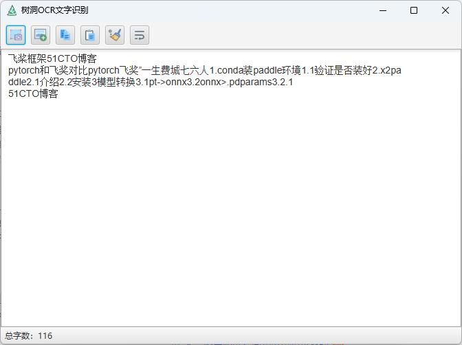
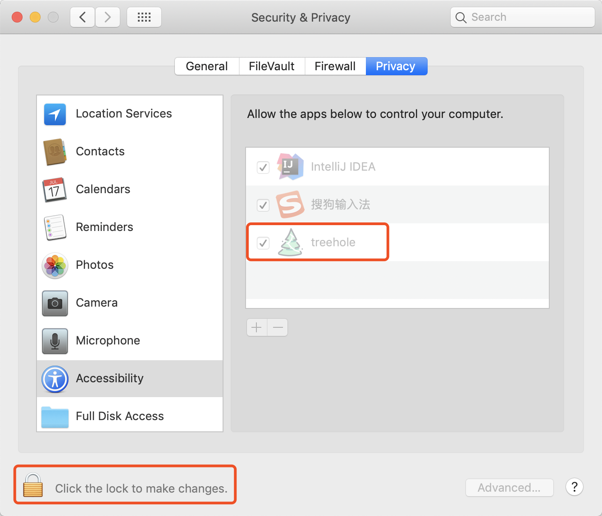
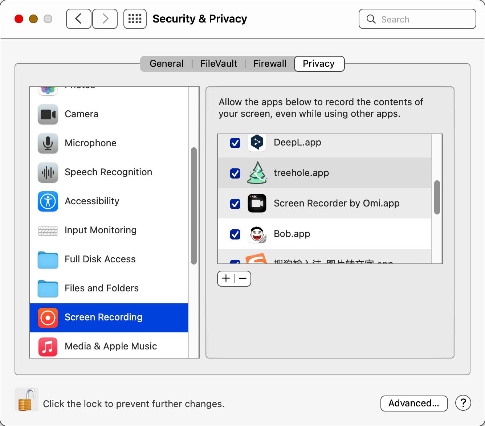

# 树洞 OCR

[English](./readme.md) | [中文](./readme-cn.md)

## 介绍

- 本地 OCR 识别
  : 树洞 OCR 文字识别工具无需联网，通过调用本地 OCR 技术，基于 Paddle OCR 模型和深度学习框架如 PyTorch、DJL，提供快速准确的文字识别。
- 跨平台兼容
  : 基于 java 1.8 和 JavaFX 开发，支持在不同操作系统上运行，包括 Mac OS X 12.6 及以上版本。
- 强大的功能支持
  : 除了基础的文字识别，还包括 PDF 识别、图片文字识别、快捷键截图识别等功能.

## 主要依赖库

- jdk 1.8
- javafx
- djl
- pytorch
- onnx
- paddle ocr
- opencv

## 开源地址

[gitee](https://gitee.com/ppnt/tools-ocr) | [github](https://github.com/litongjava/tools-ocr)

## document

https://tree-hole-ocr-docs.vercel.app/

## required

- Mac OS X 12.6 因为依赖 djl 0.25.0

## 安装

> - **安装路径请勿包含中文字符**；
> - 本程序使用 JavaFX 开发，提供的安装包中已经包含了 Java
> - 从[release](https://github.com/litongjava/tools-ocr/releases/)下载最新版本解压安装即可

## 程序使用

### 截图

- 方法一：在程序主界面点击截图按钮；
- 方法二：点击截图快捷键 F4。

### 圈选区域

进入截图界面后，按下鼠标左键，然后拖动即可圈选所要截取的区域；
圈选结束后，可以对圈选的区域进行微调：

- 使用 **方向键**，可以对所选区域的右边界和上边界进行微调；
- 使用 **Shift+方向键**，可以对所选区域的左边界和下边界进行微调；
- 使用 **Ctrl+A**，可以全选整个屏幕。

### 确定圈选

圈选完成后，点击 `Enter` 或者 `Space` 键，或者鼠标左键双击即可确认圈选；确认圈选后，会自动对所选区域进行 OCR 文字识别。




## 本地构建

### 下载模型并解压

```
wget https://github.com/litongjava/tools-ocr/releases/download/model-ppocr-v4/ch_PP-OCRv4_rec_infer-onnx.zip
wget https://github.com/litongjava/tools-ocr/releases/download/model-ppocr-v4/ch_PP-OCRv4_det_infer-onnx.zip
```

解压模型

```
mkdir models/ch_PP-OCRv4_rec_infer
mkdir models/ch_PP-OCRv4_det_infer
unzip /Users/mac/Downloads/ch_PP-OCRv4_rec_infer-onnx.zip -d models/ch_PP-OCRv4_rec_infer
unzip /Users/mac/Downloads/ch_PP-OCRv4_det_infer-onnx.zip -d models/ch_PP-OCRv4_det_infer
```

### 构建程序

你下载代码在本地进行构建,构建命令如下
windows

```
mkdir target\jfx\app
cp -r models target\jfx\app
mvn jfx:native -DskipTests -f pom.xml
```

macos

```shell script
rm -rf target/jfx/app
mkdir -p target/jfx/app
cp -r models target/jfx/app
mvn jfx:native -DskipTests -f pom.xml
```

## 查看系统运行日志

cd treehole.app/Contents/java/logs

## 注意事项

### MAC 权限设置

由于监控了截图快捷键，因此 MAC 需要开启相应的权限，请见下图：
笔者设置如下

- Settings-->Security and Privacy-->Accessbility
  
- Settings-->Security and Privacy-->Screen Recording
  

## 常用目录

- 日志目录/Applications/treehole.app/Contents/Java/logs
- 临时图片保存目录 /Applications/treehole.app/Contents/Java

## TODO

- [x] PDF 识别
- [x] 图片文字识别
  - [x] 识别结果文本对齐（暂未实现多分栏）
  - [x] 全屏模式下截图
  - [x] 添加正在识别动画
  - [x] 多屏支持
- [ ] 文本翻译
- [ ] 公式识别
- [ ] 表格识别
- [ ] 软件设置
