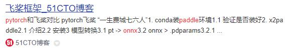
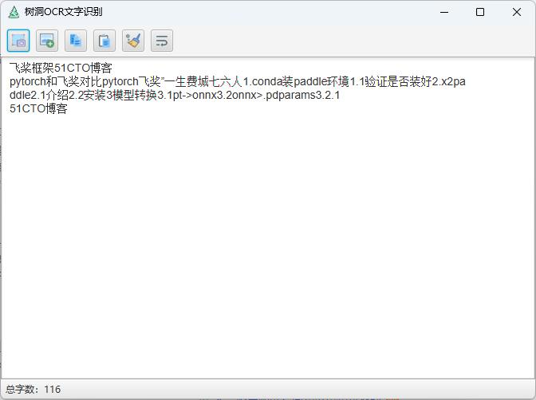

# 树洞 OCR 文字识别
一款跨平台的 OCR 小工具,调用本地OCR进行识别,无需联网即可使用
用到的技术和框架
- jdk 1.8
- javafx
- djl
- pytorch
- onnx
- paddle ocr
- opencv

## 开源地址
[gitee](https://gitee.com/ppnt/tools-ocr) | [github](https://github.com/litongjava/tools-ocr)
## 安装
> - **安装路径请勿包含中文字符**；
> - 本程序使用 JavaFX 开发，提供的安装包中已经包含了Java
> - 从[release](https://github.com/litongjava/tools-ocr/releases/)下载最新版本解压安装即可


## 程序使用
### 启动截图
- 方法一：在程序主界面点击截图按钮；
- 方法二：点击截图快捷键 F4。

### 圈选区域
进入截图界面后，按下鼠标左键，然后拖动即可圈选所要截取的区域；
圈选结束后，可以对圈选的区域进行微调：
- 使用 **方向键**，可以对所选区域的右边界和上边界进行微调；
- 使用 **Shift+方向键**，可以对所选区域的左边界和下边界进行微调；
- 使用 **Ctrl+A**，可以全选整个屏幕。

### 确定圈选
圈选完成后，点击 `Enter` 或者 `Space` 键，或者鼠标左键双击即可确认圈选；确认圈选后，会自动对所选区域进行 OCR 文字识别。




## 本地构建
你下载代码在本地进行构建,构建命令如下
```
mkdir target\jfx\app
cp -r models target\jfx\app
mvn jfx:native -DskipTests -f pom.xml
```
## 注意事项
### MAC权限设置
由于监控了截图快捷键，因此MAC需要开启相应的权限，请见下图：


笔者设置如下


## TODO
- [x] PDF识别
- [x] 图片文字识别
  - [x] 识别结果文本对齐（暂未实现多分栏）
  - [x] 全屏模式下截图
  - [x] 添加正在识别动画
  - [x] 多屏支持
- [ ] 文本翻译
- [ ] 公式识别
- [ ] 表格识别
- [ ] 软件设置

